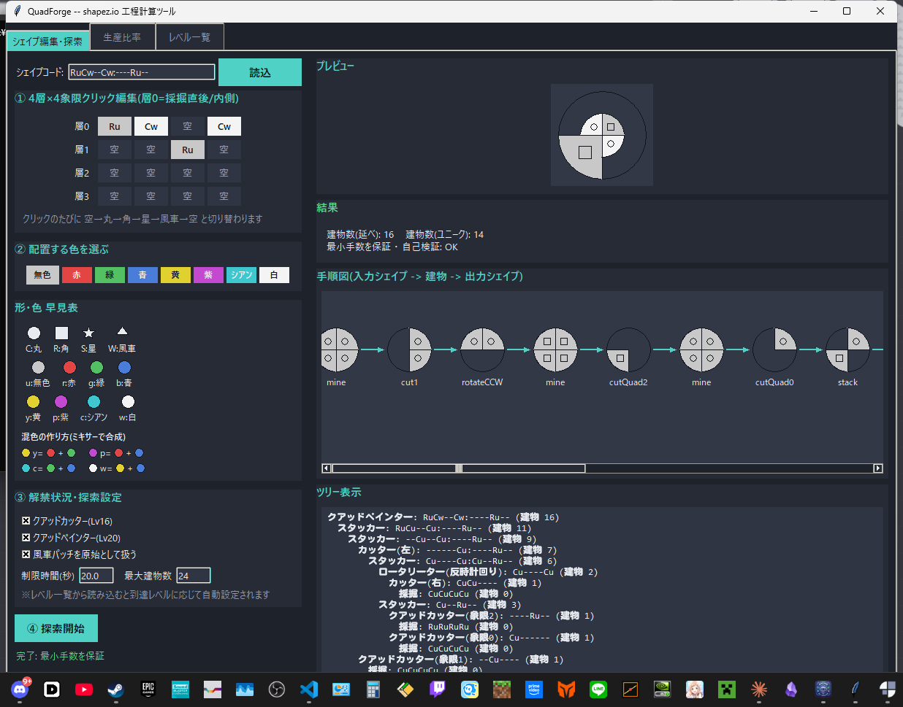

# shapez.io (QuadForge)

[日本語](#日本語) | [English](#english)

<p align="center">
  
</p>

---

## 日本語

**QuadForge** は [shapez.io](https://shapez.io/) 用の非公式プレイ支援ツールです。目標のシェイプ(またはレベル)を指定すると、それを作るための建物数最小の構築手順を自動で逆算します。

### 主な機能

- 4層×4象限のグリッドをクリックしてシェイプを直接編集(丸/角/星/風車 × 8色)
- レベル一覧(全26レベル)から目標シェイプ・必要個数をワンクリックで読み込み
- 逆算探索により**最小建物数を保証**する構築手順を算出(不可能な場合のみ実用解にフォールバックし、その旨を明示)
- クアッドカッター(Lv16解禁)・クアッドペインター(Lv20解禁)に対応
- 目標個数から必要な採掘機/処理ライン数(スループット)を計算
- GUI(tkinter)とCLI(`python main.py <シェイプコード>`)の両対応
- 手順図はステップごとに成長しながら表示されるアニメーション付き
- よく使うシェイプコードをお気に入り登録して呼び出し
- 構築手順をテキストファイルへ書き出し
- 複数の目標シェイプをバッチタブでまとめて計算
- `mod_config.json` を置くとカスタム形状・色・レベルを追加できる(下記「mod対応」参照)

### 動作環境

- Python 3.10 以降(Windows標準インストーラなら tkinter 同梱)
- 追加の外部ライブラリは不要(標準ライブラリのみで動作)

### 実行方法

```bash
python main.py                    # GUIを起動
python main.py <シェイプコード>    # CLIで1件だけ計算して終了(例: RuCw--Cw:----Ru--)
```

### ビルド済みexeの入手

ソースを用意しなくても、[Releases](../../releases) から `QuadForge.exe` をダウンロードしてそのまま実行できます。

### ソースからexeをビルドする

```bash
pip install pyinstaller
build.bat
```

`dist\QuadForge.exe` が生成されます。

### テスト

```bash
python -m pytest
```

36件のテストが通ります(mod対応・バッチ計算・お気に入り・エクスポート機能のテストを含む)。

### mod対応

実行ファイル(ソース実行時は `main.py`)と同じフォルダに `mod_config.json` を置くと、起動時に自動で読み込まれます。ファイルが存在しない、または壊れている場合は無視され、バニラ動作のまま起動します。

```json
{
  "subshapes": "X",
  "colors": {"m": "#ff8800"},
  "levels": [
    {"level": 27, "shape": "XmXmXmXm", "required": 500, "reward": "mod_reward_1"}
  ]
}
```

- `subshapes`: 追加する形状記号(半角英大文字1文字ずつ)
- `colors`: 追加する色記号(半角英小文字1文字)と16進カラーコードの対応
- `levels`: 追加/上書きするレベル定義(`shape` には上記で追加した記号も使えます)

形状・色・レベルの「定義」を追加するだけの機能であり、mod側が実装する独自の建物ロジックまでは再現できません。

### 既知の制限事項

全26レベルのうち、Lv26のみ「浮いたシェイプ」構造(4象限すべてがどこかの層で使用済みで、捨て駒に使える空き象限が存在しない)に対する最小手数保証の解法が未実装です。それ以外の25レベルは最小建物数を保証した解が得られます。

### ライセンス・謝辞

このツールの `shape.py`(シェイプ演算)・`levels.py`(レベルデータ)は、[tobspr-games/shapez.io](https://github.com/tobspr-games/shapez.io)(GPL-3.0)の `shape_definition.js` / `levels.js` を Python に移植したものです。そのため本リポジトリ全体も **GPL-3.0** で公開しています(詳細は [LICENSE](LICENSE))。

本ツールは非公式のファンメイドツールであり、tobspr-games とは関係がなく、公式の承認を受けたものでもありません。shapez.io 本体の画像・音声・その他のアセットは同梱していません。

---

## English

**QuadForge** is an unofficial companion tool for [shapez.io](https://shapez.io/). Given a target shape (or a level), it works backward to compute a construction plan that uses the minimum possible number of buildings.

### Features

- Edit shapes directly by clicking a 4-layer × 4-quadrant grid (circle/rectangle/star/windmill × 8 colors)
- Load any of the 26 official levels' target shape and required count with one click
- Backward search that **guarantees the minimum building count** whenever possible, falling back to a practical (non-minimal) solution only when it must — and says so clearly
- Supports the quad cutter (unlocked at Lv16) and quad painter (unlocked at Lv20)
- Computes required miner/processing throughput from a target quantity
- Both GUI (tkinter) and CLI (`python main.py <shape-code>`) modes
- The construction-plan diagram animates step by step as it reveals
- Save frequently used shape codes as favorites for quick recall
- Export a construction plan to a text file
- Batch-solve multiple target shapes at once from the Batch tab
- Drop in a `mod_config.json` to add custom shape types, colors, and levels (see "Mod support" below)

### Requirements

- Python 3.10+ (tkinter ships with the standard Windows installer)
- No third-party dependencies — standard library only

### Running from source

```bash
python main.py                    # launches the GUI
python main.py <shape-code>       # computes one plan on the command line, e.g. RuCw--Cw:----Ru--
```

### Prebuilt executable

Grab `QuadForge.exe` from the [Releases](../../releases) page and run it directly — no Python install needed.

### Building the exe yourself

```bash
pip install pyinstaller
build.bat
```

Produces `dist\QuadForge.exe`.

### Tests

```bash
python -m pytest
```

36 tests, all passing (includes tests for mod support, batch mode, favorites, and export).

### Mod support

Place a `mod_config.json` next to the executable (or `main.py` when running from source) and it's loaded automatically at startup. A missing or malformed file is silently ignored and the app starts with vanilla defaults.

```json
{
  "subshapes": "X",
  "colors": {"m": "#ff8800"},
  "levels": [
    {"level": 27, "shape": "XmXmXmXm", "required": 500, "reward": "mod_reward_1"}
  ]
}
```

- `subshapes`: new shape-type letters to add (single uppercase ASCII letters)
- `colors`: new color letters (single lowercase ASCII letters) mapped to hex colors
- `levels`: level definitions to add or override (`shape` may use the letters added above)

This only extends shape/color/level *definitions* — it can't reproduce a mod's own custom building logic.

### Known limitation

Of the 26 official levels, Level 26 is the one case where the "floating shape" structure (all 4 quadrants are occupied somewhere in the shape, leaving no free quadrant to use as a disposable placeholder) isn't yet handled by the minimum-guaranteeing solver. The other 25 levels all produce a guaranteed-minimal plan.

### License & Credits

`shape.py` (shape math) and `levels.py` (level data) are ported from [tobspr-games/shapez.io](https://github.com/tobspr-games/shapez.io) (`shape_definition.js` / `levels.js`), which is licensed under GPL-3.0. Accordingly, this repository is also licensed under **GPL-3.0** (see [LICENSE](LICENSE)).

This is an unofficial, fan-made tool with no affiliation to or endorsement from tobspr-games. No shapez.io game assets (images, audio, etc.) are included.
